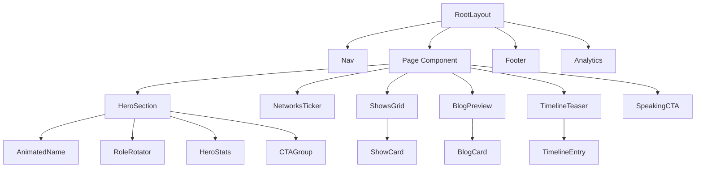
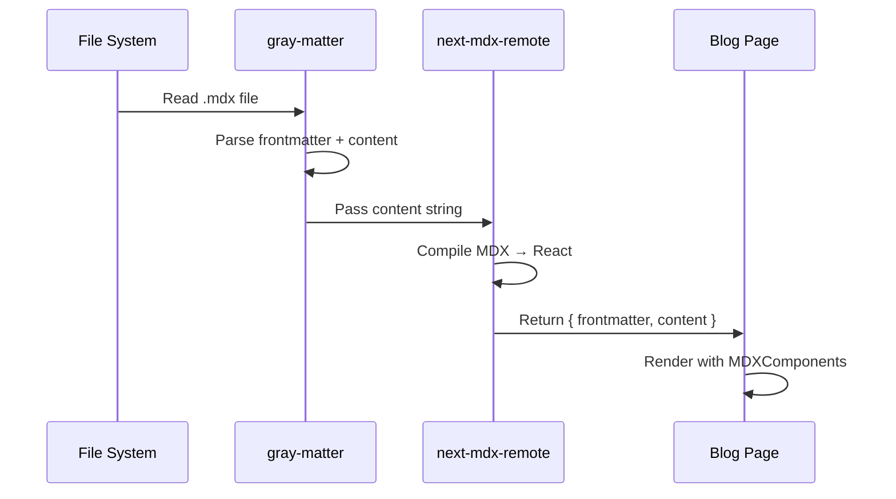

# Design Document: Portfolio Site Rebuild — Eugine Micah

## Overview

A full rebuild of euginemicah.tech into a bold, editorial, cinematic personal brand site inspired by stevenbartlett.com — dark, fast, and visually striking. The site introduces an MDX-powered blog system, redesigns all existing pages with a consistent design language, and adds new sections (timeline, speaking CTA, news grid) while preserving the existing Next.js 16 / React 19 / TypeScript / Tailwind v4 / Vercel stack.

The design philosophy: maximum visual impact with minimum JavaScript. Static generation everywhere possible, ISR for blog content, Next.js Image for all photos, and CSS-driven animations over JS-driven ones.

---

## Architecture

### High-Level System Architecture

```mermaid
graph TD
    A[Next.js App Router] --> B[Static Pages]
    A --> C[ISR Pages]
    A --> D[API Routes]

    B --> B1[Home /]
    B --> B2[About /about]
    B --> B3[Shows /shows]
    B --> B4[Career /career]
    B --> B5[Gallery /gallery]
    B --> B6[Press /press]
    B --> B7[Contact /contact]

    C --> C1[Blog List /blog]
    C --> C2[Blog Post /blog/slug]

    D --> D1[/api/contact - form submission]

    E[Content Layer] --> E1[/content/blog/*.mdx]
    E1 --> C1
    E1 --> C2

    F[Asset Layer] --> F1[/public/images/]
    F --> F2[/public/gallery/]
    F --> F3[Google Fonts CDN]

    G[Shared Components] --> G1[Nav]
    G --> G2[Footer]
    G --> G3[PageHeader]
    G --> G4[SectionLabel]
    G --> G5[AnimatedText]
```

### Component Hierarchy



---

## Page-by-Page Layout Design

### Home Page (`/`)

**Sections in order:**

1. `HeroSection` — full-bleed, 100vh, name + role rotator + stats + CTAs + cutout photo
2. `NetworksTicker` — "AS SEEN ON" scrolling marquee bar
3. `ShowsPreviewGrid` — 2-col grid, 4 featured shows
4. `BlogNewsPreview` — 3-col grid, latest 3 blog posts
5. `TimelineTeaser` — 3 milestone cards with "View Full Timeline →" CTA
6. `SpeakingCTA` — full-width dark band with booking CTA
7. `MemoirBanner` — book promo strip (existing, keep)

**Hero layout detail:**

```
┌─────────────────────────────────────────────────────┐
│  [ON AIR indicator]                                  │
│                                                      │
│  Eugine          [cutout photo, right-aligned,       │
│  Micah           bottom-anchored, z-index above bg]  │
│                                                      │
│  [Role rotator — animated]                           │
│  [Bio copy — 2 lines]                                │
│  [WATCH MY SHOWS]  [BOOK FOR EVENT]                  │
│                                                      │
│  700K+   20M+   3M+   100+                           │
│  ─────   ────   ───   ────                           │
└─────────────────────────────────────────────────────┘
```

### About Page (`/about`)

**Sections:**

1. `PageHeader` — label + large italic title
2. `BioCols` — 2-col: portrait left, bio paragraphs right
3. `PhilosophyQuote` — full-width pull quote in large serif italic
4. `TimelineFull` — vertical timeline (reused from Career, filtered to key personal milestones)
5. `ValuesGrid` — 3-col grid of core values/beliefs

### Shows Page (`/shows`)

**Sections:**

1. `PageHeader`
2. `FeaturedShow` — full-width hero card for Urban News with thumbnail
3. `ShowsGrid` — 2-col grid for remaining 5 shows, each with cover image
4. `ShowCTA` — booking strip

### Career Page (`/career`)

**Sections:**

1. `PageHeader`
2. `CareerStats` — 4-col stat bar
3. `WorkExperience` — list of job cards
4. `TimelineFull` — full vertical timeline with all milestones

### Gallery Page (`/gallery`)

**Sections:**

1. `PageHeader`
2. `FilterBar` — category filter pills
3. `MasonryGrid` — CSS columns masonry using real `/public/images/gallery/` photos
4. `LightboxModal` — click-to-expand overlay

### Press Page (`/press`)

**Sections:**

1. `PageHeader`
2. `PressLayout` — 2-col: downloads left, bio + networks right
3. `MediaImpactStats` — 4-col stat grid
4. `MediaInquiryCTA`

### Blog List Page (`/blog`)

**Sections:**

1. `BlogHero` — featured post full-bleed card (first `featured: true` post)
2. `BlogGrid` — 3-col grid of remaining posts
3. `CategoryFilter` — filter by category

### Blog Post Page (`/blog/[slug]`)

**Sections:**

1. `PostHeader` — cover image, title, date, category, reading time
2. `PostBody` — MDX rendered content with custom components
3. `PostFooter` — author card + related posts

### Contact Page (`/contact`)

**Sections:**

1. `PageHeader`
2. `ContactLayout` — 2-col: info + availability left, socials + CTA right
3. `ContactForm` — name, email, subject, message with server action

---

## Blog / MDX System

### File Structure

```
/content/
  blog/
    my-first-post.mdx
    digital-strategy-kenya.mdx
    ...
```

### Frontmatter Schema

```typescript
interface BlogFrontmatter {
  title: string; // Post title
  date: string; // ISO date string "2025-01-15"
  excerpt: string; // 1-2 sentence summary for cards
  category: BlogCategory; // "Media" | "Digital Strategy" | "Culture" | "Personal"
  coverImage: string; // Path relative to /public, e.g. "/images/blog/cover.jpg"
  featured?: boolean; // If true, shown as hero on /blog
  readingTime?: number; // Minutes — auto-calculated if omitted
  tags?: string[]; // Optional tags array
}

type BlogCategory = "Media" | "Digital Strategy" | "Culture" | "Personal";
```

### MDX Processing Pipeline



### Required Packages

```
next-mdx-remote        # MDX compilation + rendering
gray-matter            # Frontmatter parsing
reading-time           # Auto reading time calculation
```

### Routing

| Route                  | Strategy                      | Revalidation |
| ---------------------- | ----------------------------- | ------------ |
| `/blog`                | ISR                           | 3600s (1hr)  |
| `/blog/[slug]`         | ISR                           | 3600s (1hr)  |
| `generateStaticParams` | All slugs pre-built at deploy | —            |

---

## TypeScript Interfaces

### Core Data Types

```typescript
// src/types/index.ts

export interface Show {
  title: string;
  role: string;
  platform: string;
  episodes: string;
  desc: string;
  color: string;
  tag: string;
  url: string;
  thumb?: string;
  coverImage?: string;
}

export interface TimelineEntry {
  year: string;
  title: string;
  org: string;
  type: TimelineType;
  desc: string;
}

export type TimelineType =
  | "CURRENT"
  | "LAUNCH"
  | "MEDIA"
  | "AWARD"
  | "EDUCATION"
  | "BOOK"
  | "PRESS"
  | "CAREER"
  | "BUSINESS"
  | "ORIGIN";

export interface Stat {
  value: string;
  label: string;
  accent: string;
}

export interface NavLink {
  href: string;
  label: string;
}

export interface SocialLink {
  name: string;
  url: string;
  handle?: string;
}

export interface BlogPost {
  slug: string;
  title: string;
  date: string;
  excerpt: string;
  category: BlogCategory;
  coverImage: string;
  featured: boolean;
  readingTime: number;
  tags: string[];
}

export type BlogCategory =
  | "Media"
  | "Digital Strategy"
  | "Culture"
  | "Personal";

export interface GalleryItem {
  id: number;
  category: GalleryCategory;
  src: string;
  title: string;
  color: string;
  width?: number;
  height?: number;
}

export type GalleryCategory = "ALL" | "TV" | "STUDIO" | "BTS" | "EVENTS";

export interface PressResource {
  label: string;
  size: string;
  type: "PDF" | "ZIP" | "PNG" | "SVG";
  href?: string;
}

export interface WorkHistory {
  company: string;
  role: string;
  period: string;
  description: string;
}

export interface ContactInfo {
  label: string;
  value: string;
  href?: string;
}
```

---

## Component API Signatures

### Layout Components

```typescript
// Nav — no props, self-contained with scroll detection
export default function Nav(): JSX.Element;

// Footer — no props, static
export default function Footer(): JSX.Element;

// PageHeader
interface PageHeaderProps {
  label: string; // Mono uppercase label e.g. "SHOWS & PRODUCTIONS"
  title: string; // Large serif italic heading
  subtitle?: string; // Optional body copy
  accentColor?: string; // Override accent (default: #FF2D2D)
}
export default function PageHeader(props: PageHeaderProps): JSX.Element;
```

### Home Page Components

```typescript
// HeroSection
interface HeroSectionProps {
  roles: string[]; // Rotating role strings
  stats: Stat[];
}
export default function HeroSection(props: HeroSectionProps): JSX.Element;

// NetworksTicker
interface NetworksTickerProps {
  networks: string[];
  label?: string; // Default: "AS SEEN ON"
}
export default function NetworksTicker(props: NetworksTickerProps): JSX.Element;

// ShowsPreviewGrid
interface ShowsPreviewGridProps {
  shows: Show[]; // Max 4 shown
  title?: string;
}
export default function ShowsPreviewGrid(
  props: ShowsPreviewGridProps,
): JSX.Element;

// BlogNewsPreview
interface BlogNewsPreviewProps {
  posts: BlogPost[]; // Max 3 shown
}
export default function BlogNewsPreview(
  props: BlogNewsPreviewProps,
): JSX.Element;

// TimelineTeaser
interface TimelineTeaserProps {
  entries: TimelineEntry[]; // Max 3 shown
}
export default function TimelineTeaser(props: TimelineTeaserProps): JSX.Element;

// SpeakingCTA — no props, static content
export default function SpeakingCTA(): JSX.Element;
```

### Shared UI Components

```typescript
// ShowCard
interface ShowCardProps {
  show: Show;
  featured?: boolean; // If true, renders full-width hero variant
}
export default function ShowCard(props: ShowCardProps): JSX.Element;

// BlogCard
interface BlogCardProps {
  post: BlogPost;
  variant?: "hero" | "grid" | "compact";
}
export default function BlogCard(props: BlogCardProps): JSX.Element;

// TimelineEntry
interface TimelineEntryProps {
  entry: TimelineEntry;
  isFirst?: boolean;
  isLast?: boolean;
  typeColors: Record<TimelineType, string>;
}
export default function TimelineEntryComponent(
  props: TimelineEntryProps,
): JSX.Element;

// SectionLabel
interface SectionLabelProps {
  text: string;
  color?: string; // Default: #FF2D2D
}
export default function SectionLabel(props: SectionLabelProps): JSX.Element;

// AnimatedText (role rotator)
interface AnimatedTextProps {
  texts: string[];
  interval?: number; // ms between rotations, default 2000
  className?: string;
}
export default function AnimatedText(props: AnimatedTextProps): JSX.Element;

// GalleryGrid
interface GalleryGridProps {
  items: GalleryItem[];
  filter: GalleryCategory;
}
export default function GalleryGrid(props: GalleryGridProps): JSX.Element;

// LightboxModal
interface LightboxModalProps {
  item: GalleryItem | null;
  onClose: () => void;
}
export default function LightboxModal(props: LightboxModalProps): JSX.Element;

// ContactForm — no props, uses server action
export default function ContactForm(): JSX.Element;

// MDXComponents — custom renderers for blog MDX
export const MDXComponents: MDXRemoteProps["components"];
```

---

## CSS / Styling Architecture

### Tailwind v4 Configuration

Tailwind v4 uses CSS-first configuration via `@theme` in `globals.css`. No `tailwind.config.js` needed.

```css
/* globals.css additions */
@import "tailwindcss";

@theme {
  --color-bg: #000000;
  --color-surface: rgba(255, 255, 255, 0.015);
  --color-border: rgba(255, 255, 255, 0.04);
  --color-red: #ff2d2d;
  --color-orange: #ff6b35;
  --color-gold: #ffb800;
  --color-green: #00e5a0;
  --color-blue: #00b4ff;
  --color-purple: #a855f7;

  --font-serif: "Instrument Serif", serif;
  --font-sans: "DM Sans", sans-serif;
  --font-mono: "JetBrains Mono", monospace;

  --ease-spring: cubic-bezier(0.16, 1, 0.3, 1);
}
```

### Styling Approach

- **Inline styles** for one-off layout values (padding, specific colors) — already established pattern in codebase, keep consistent
- **CSS classes** in `globals.css` for reusable interactive states (hover, transitions, animations)
- **Tailwind utilities** for responsive breakpoints and common spacing
- **No CSS Modules** — keep flat globals.css pattern already in use

### New CSS Classes Needed

```css
/* Blog */
.blog-card {
  transition: all 0.4s var(--ease-spring);
}
.blog-card:hover {
  transform: translateY(-4px);
  border-color: rgba(255, 255, 255, 0.12) !important;
}

/* Masonry gallery */
.masonry-grid {
  columns: 3;
  column-gap: 16px;
}
.masonry-item {
  break-inside: avoid;
  margin-bottom: 16px;
}
@media (max-width: 768px) {
  .masonry-grid {
    columns: 2;
  }
}
@media (max-width: 480px) {
  .masonry-grid {
    columns: 1;
  }
}

/* Ticker animation */
@keyframes ticker {
  from {
    transform: translateX(0);
  }
  to {
    transform: translateX(-50%);
  }
}
.ticker-track {
  animation: ticker 20s linear infinite;
}
.ticker-track:hover {
  animation-play-state: paused;
}

/* Lightbox */
.lightbox-overlay {
  animation: fadeIn 0.2s ease;
}

/* MDX prose */
.mdx-body h2 {
  font-family: var(--font-serif);
  font-style: italic;
  font-size: 2rem;
  margin: 2rem 0 1rem;
}
.mdx-body p {
  line-height: 1.8;
  color: rgba(255, 255, 255, 0.65);
  margin-bottom: 1.25rem;
}
.mdx-body blockquote {
  border-left: 3px solid #ff2d2d;
  padding-left: 1.5rem;
  font-style: italic;
  color: rgba(255, 255, 255, 0.5);
}
.mdx-body code {
  font-family: var(--font-mono);
  background: rgba(255, 255, 255, 0.06);
  padding: 2px 6px;
  font-size: 0.85em;
}

/* Responsive additions */
@media (max-width: 768px) {
  .blog-grid {
    grid-template-columns: 1fr !important;
  }
  .masonry-grid {
    columns: 2;
  }
  .hero-photo {
    display: none;
  } /* hide cutout on mobile */
}
```

---

## Animation Strategy

### Principle: CSS-first, JS-minimal

All animations use CSS keyframes or CSS transitions. JavaScript is only used for:

1. Scroll position detection (Nav background)
2. Role text rotation (setInterval)
3. Gallery filter state
4. Lightbox open/close state

### Animation Inventory

| Element                         | Technique                                               | Duration    |
| ------------------------------- | ------------------------------------------------------- | ----------- |
| Page load fade-up               | CSS `fadeUp` keyframe + `.fu` class + staggered delays  | 1s          |
| Role text rotation              | CSS `roleSlide` keyframe, triggered by React key change | 2s          |
| Show card hover                 | CSS `transform: translateY(-4px) scale(1.01)`           | 0.4s spring |
| Nav background                  | CSS `transition: all .5s` on inline style change        | 0.5s        |
| Top border reveal on card hover | CSS `width: 0% → 100%` transition                       | 0.5s spring |
| Networks ticker                 | CSS `@keyframes ticker` infinite scroll                 | 20s linear  |
| Blog card hover                 | CSS `transform: translateY(-4px)`                       | 0.4s spring |
| Gallery item hover              | CSS `transform: scale(1.02)` + inner img `scale(1.08)`  | 0.6s spring |
| Lightbox open                   | CSS `fadeIn` keyframe                                   | 0.2s        |
| Timeline dot hover              | CSS `transform: scale(1.5)` + `box-shadow`              | 0.3s        |

### Scroll-triggered Animations

Use `IntersectionObserver` (not a library) to add `.visible` class when sections enter viewport:

```typescript
// src/hooks/useInView.ts
export function useInView(ref: RefObject<Element>, threshold = 0.1): boolean;
```

CSS:

```css
.reveal {
  opacity: 0;
  transform: translateY(40px);
  transition:
    opacity 0.8s var(--ease-spring),
    transform 0.8s var(--ease-spring);
}
.reveal.visible {
  opacity: 1;
  transform: translateY(0);
}
```

---

## SEO / Metadata Approach

### Static Pages

Each page exports a `metadata` object using Next.js App Router conventions:

```typescript
// Example: src/app/blog/page.tsx
export const metadata: Metadata = {
  title: "Blog & Stories",
  description:
    "Thoughts on media, digital strategy, and Kenyan culture by Eugine Micah.",
  openGraph: {
    title: "Blog — Eugine Micah",
    images: [{ url: "/images/og-blog.jpg" }],
  },
};
```

### Dynamic Blog Posts

```typescript
// src/app/blog/[slug]/page.tsx
export async function generateMetadata({
  params,
}: {
  params: { slug: string };
}): Promise<Metadata> {
  const post = await getPostBySlug(params.slug);
  return {
    title: post.title,
    description: post.excerpt,
    openGraph: {
      title: post.title,
      description: post.excerpt,
      images: [{ url: post.coverImage }],
      type: "article",
      publishedTime: post.date,
    },
    twitter: {
      card: "summary_large_image",
      title: post.title,
      description: post.excerpt,
      images: [post.coverImage],
    },
  };
}
```

### Structured Data (JSON-LD)

Add to `RootLayout` for Person schema:

```typescript
const personSchema = {
  "@context": "https://schema.org",
  "@type": "Person",
  name: "Eugine Micah",
  jobTitle: "TV Host, Journalist & Digital Strategist",
  url: "https://euginemicah.tech",
  sameAs: [
    "https://youtube.com/@euginemicah",
    "https://instagram.com/eugine.micah",
    "https://linkedin.com/in/euginemicah",
  ],
};
```

Add `Article` schema to blog post pages.

### Sitemap & Robots

- `src/app/sitemap.ts` — already exists, extend to include `/blog` and all blog slugs
- `src/app/robots.ts` — already exists, no changes needed

---

## Performance Strategy

### Image Optimization

All images use `next/image` with:

- `priority` prop on above-the-fold images (hero, featured show)
- `sizes` prop for responsive sizing
- `placeholder="blur"` with `blurDataURL` for gallery images
- WebP format auto-served by Next.js

```typescript
// Hero cutout photo
<Image
  src="/images/profile.jpg"
  alt="Eugine Micah"
  width={600}
  height={800}
  priority
  sizes="(max-width: 768px) 0px, 40vw"
  className="hero-photo"
  style={{ objectFit: "cover", objectPosition: "top" }}
/>
```

### Font Loading

Fonts already loaded via Google Fonts in `layout.tsx`. Add `font-display: swap` via `&display=swap` (already present). No changes needed.

For Tailwind v4, register fonts in `@theme` block so they're available as utilities.

### Static Generation Strategy

| Page           | Strategy     | Why                           |
| -------------- | ------------ | ----------------------------- |
| `/`            | Static (SSG) | No dynamic data               |
| `/about`       | Static       | No dynamic data               |
| `/shows`       | Static       | No dynamic data               |
| `/career`      | Static       | No dynamic data               |
| `/gallery`     | Static       | Images are static             |
| `/press`       | Static       | No dynamic data               |
| `/contact`     | Static       | Form uses client-side         |
| `/blog`        | ISR (1hr)    | MDX files change infrequently |
| `/blog/[slug]` | ISR (1hr)    | MDX files change infrequently |

### Bundle Size

- No animation libraries (Framer Motion, GSAP) — pure CSS
- No UI component libraries — custom components only
- `next-mdx-remote` only loaded on blog routes
- `@vercel/analytics` already installed, no additional analytics

---

## Blog Data Layer

### File System Utilities

```typescript
// src/lib/blog.ts

import fs from "fs";
import path from "path";
import matter from "gray-matter";
import readingTime from "reading-time";

const BLOG_DIR = path.join(process.cwd(), "content/blog");

export function getAllPosts(): BlogPost[];
export function getPostBySlug(slug: string): BlogPost & { content: string };
export function getPostsByCategory(category: BlogCategory): BlogPost[];
export function getFeaturedPost(): BlogPost | null;
```

### MDX Custom Components

```typescript
// src/components/MDXComponents.tsx

export const MDXComponents = {
  h1: (props) => <h1 className="mdx-h1" {...props} />,
  h2: (props) => <h2 className="mdx-h2" {...props} />,
  p: (props) => <p className="mdx-p" {...props} />,
  blockquote: (props) => <blockquote className="mdx-quote" {...props} />,
  code: (props) => <code className="mdx-code" {...props} />,
  img: (props) => <Image className="mdx-img" fill alt={props.alt ?? ""} src={props.src ?? ""} />,
  // Callout box component
  Callout: ({ children, type = "info" }) => (
    <div className={`mdx-callout mdx-callout-${type}`}>{children}</div>
  ),
}
```

---

## Error Handling

### Not Found Pages

```typescript
// src/app/not-found.tsx — custom 404 matching site aesthetic
// src/app/blog/[slug]/not-found.tsx — blog-specific 404
```

### Contact Form

Server action with validation:

- Required fields: name, email, message
- Email format validation
- Rate limiting via Vercel Edge Config (optional)
- Success/error state shown inline (no page reload)

---

## Dependencies to Add

```json
{
  "next-mdx-remote": "^5.0.0",
  "gray-matter": "^4.0.3",
  "reading-time": "^1.5.0"
}
```

Dev dependencies:

```json
{
  "@types/mdx": "^2.0.13"
}
```

---

## Directory Structure After Rebuild

```
src/
  app/
    page.tsx                    # Home (rebuilt)
    layout.tsx                  # Root layout (minor updates)
    globals.css                 # Extended with new classes
    not-found.tsx               # NEW: custom 404
    about/
      page.tsx                  # Rebuilt
    shows/
      page.tsx                  # Rebuilt with images
    career/
      page.tsx                  # Rebuilt
    gallery/
      page.tsx                  # Rebuilt with masonry + lightbox
    press/
      page.tsx                  # Rebuilt
    contact/
      page.tsx                  # Rebuilt with form
    blog/
      page.tsx                  # NEW: blog list
      [slug]/
        page.tsx                # NEW: blog post
    api/
      contact/
        route.ts                # NEW: contact form handler
  components/
    Nav.tsx                     # Enhanced (blog link added)
    Footer.tsx                  # Enhanced (blog link added)
    PageHeader.tsx              # Keep as-is
    SectionLabel.tsx            # NEW: reusable mono label
    AnimatedText.tsx            # NEW: role rotator
    ShowCard.tsx                # NEW: extracted from page
    BlogCard.tsx                # NEW
    TimelineEntry.tsx           # NEW: extracted from career
    GalleryGrid.tsx             # NEW: masonry + lightbox
    LightboxModal.tsx           # NEW
    ContactForm.tsx             # NEW
    MDXComponents.tsx           # NEW
    NetworksTicker.tsx          # NEW: CSS marquee
  lib/
    blog.ts                     # NEW: MDX data layer
    constants.ts                # NEW: shared data (SHOWS, TIMELINE, etc.)
  types/
    index.ts                    # NEW: all TypeScript interfaces
  hooks/
    useInView.ts                # NEW: IntersectionObserver hook
content/
  blog/
    .gitkeep                    # Placeholder until first post
```

---

## Correctness Properties

- Every page renders without hydration errors (no server/client mismatch)
- All `next/image` usages include required `alt`, `width`/`height` or `fill` props
- Blog slugs are unique — `getAllPosts()` deduplicates by filename
- `generateStaticParams` for `/blog/[slug]` returns all slugs present in `/content/blog/`
- `getPostBySlug` throws `notFound()` for missing slugs (no 500 errors)
- Contact form validates email format before submission
- All external links have `target="_blank" rel="noopener noreferrer"`
- Nav active state correctly highlights current route via `usePathname()`
- Gallery filter "ALL" shows all items; category filters show correct subset
- MDX frontmatter `date` field is always a valid ISO date string
- `featured` posts: exactly one post per blog list page is shown as hero; if none marked featured, first post by date is used
- Ticker animation pauses on hover (accessibility — `prefers-reduced-motion` respected)
- All animations respect `@media (prefers-reduced-motion: reduce)` — disable or reduce motion
