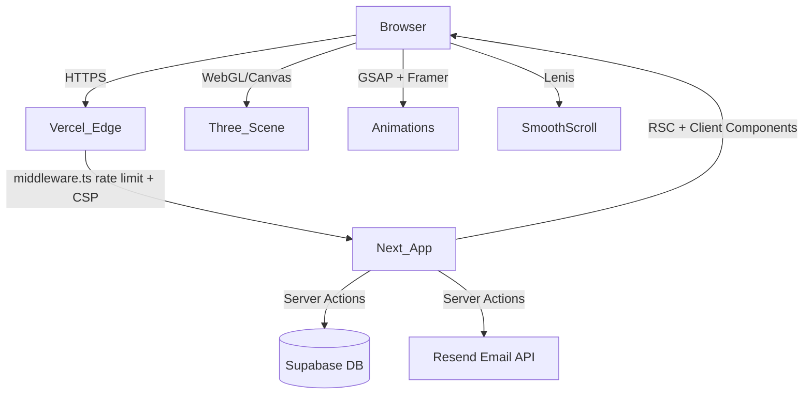
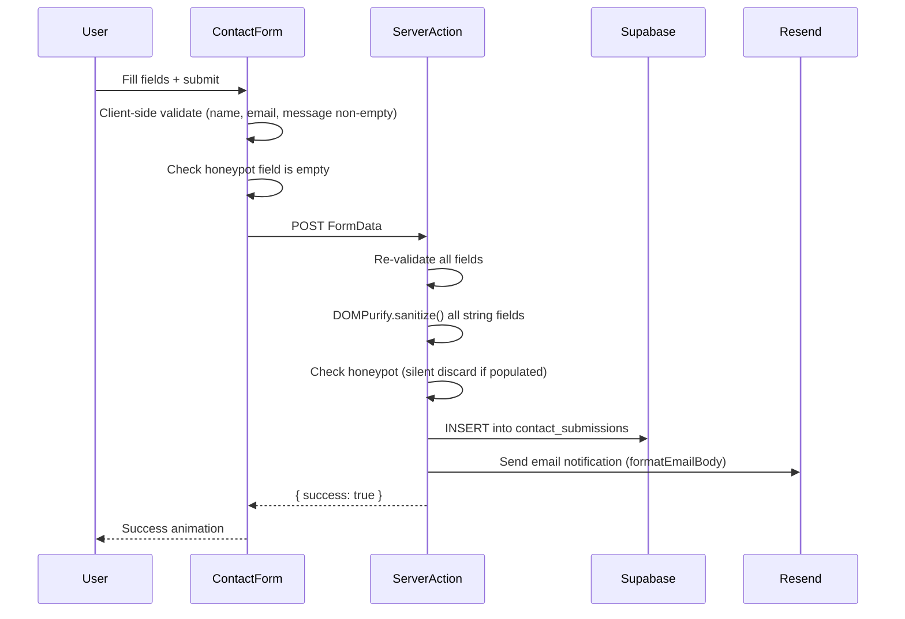

# Design Document — THE ROYLANDZ UNIVERSE

## Overview

THE ROYLANDZ UNIVERSE is a complete rebuild of euginemicah.com into a cinematic, multi-dimensional web experience. The existing Next.js portfolio is replaced in-place with 9 thematic "worlds," each with distinct visual identities, advanced animations, and narrative depth. The target emotion is jaw-dropping awe → inspiration → obsession.

The site is built on the existing repo at the workspace root. All legacy routes, components, and pages are removed and replaced. The Supabase project (`jcdefelhenqtjiotqkes`) is already provisioned and healthy.

### Key Design Goals

- Cinematic first impression via a full-screen Loader with glitch-wipe reveal
- Consistent design system (CSS Custom Properties + Tailwind) across all 9 worlds
- Progressive enhancement: full 3D/WebGL on desktop, graceful degradation on mobile
- Sub-1.8s LCP via dynamic imports, image optimization, and edge caching
- Secure contact pipeline: validation → sanitization → Supabase → Resend email

---

## Architecture

### Technology Stack

| Layer          | Technology                                 | Version                                        |
| -------------- | ------------------------------------------ | ---------------------------------------------- |
| Framework      | Next.js App Router                         | 14 (upgrade from current 16.1.6 — pin to 14.x) |
| Language       | TypeScript                                 | 5.x                                            |
| Styling        | Tailwind CSS v3 + CSS Custom Properties    | 3.x                                            |
| Animation      | GSAP 3 + ScrollTrigger                     | 3.x                                            |
| Animation      | Framer Motion                              | 11.x                                           |
| 3D/WebGL       | Three.js r165 via React Three Fiber + Drei | r165 / 8.x                                     |
| Smooth Scroll  | Lenis                                      | 1.x                                            |
| Audio          | Howler.js                                  | 2.x                                            |
| Backend        | Supabase (existing project)                | —                                              |
| Email          | Resend API                                 | 3.x                                            |
| Analytics      | Vercel Analytics                           | 1.x                                            |
| Particles      | tsParticles                                | 3.x                                            |
| Sanitization   | DOMPurify (isomorphic-dompurify for SSR)   | 3.x                                            |
| Testing (unit) | Vitest + React Testing Library             | —                                              |
| Testing (PBT)  | fast-check                                 | 3.x                                            |

> Note: The current package.json lists `next: 16.1.6`. Requirements specify Next.js 14 App Router. The package should be pinned to `14.2.x` during implementation.

### High-Level System Diagram



### Request Lifecycle

1. Browser hits Vercel Edge → `middleware.ts` checks rate limit (IP-based, in-memory or Upstash Redis)
2. Next.js App Router resolves route → RSC renders shell, streams to browser
3. Client hydrates → Lenis initializes, GoldCursor mounts, CurtainTransition registers
4. Heavy libs (Three.js, GSAP, tsParticles) load via dynamic imports after hydration
5. Contact form submit → Server Action → validate → sanitize → Supabase insert → Resend notify

---

## Directory Structure

```
src/
├── app/
│   ├── layout.tsx                  # Root layout: fonts, GoldCursor, Lenis, CurtainTransition
│   ├── globals.css                 # CSS Custom Properties + base styles
│   ├── page.tsx                    # Portal (/)
│   ├── origin/page.tsx             # Origin (/origin)
│   ├── broadcast/page.tsx          # Broadcast (/broadcast)
│   ├── empire/page.tsx             # Empire (/empire)
│   ├── memoir/page.tsx             # Word (/memoir)
│   ├── movement/page.tsx           # Movement (/movement)
│   ├── future/page.tsx             # Oracle (/future)
│   ├── archive/page.tsx            # Archive (/archive)
│   ├── contact/page.tsx            # Signal (/contact)
│   ├── api/
│   │   └── contact/route.ts        # API route fallback (server action preferred)
│   └── robots.ts / sitemap.ts
├── components/
│   ├── global/
│   │   ├── GoldCursor.tsx
│   │   ├── Nav.tsx                 # Floating pill nav (desktop) + bottom nav (mobile)
│   │   ├── MobileNav.tsx           # Full-screen overlay nav
│   │   ├── CurtainTransition.tsx
│   │   ├── LenisProvider.tsx
│   │   ├── ScrambleText.tsx
│   │   └── MagneticButton.tsx
│   ├── home/
│   │   ├── Loader.tsx
│   │   ├── HeroScene.tsx           # Three.js star field + portrait
│   │   ├── StatsBar.tsx
│   │   ├── HexCard.tsx
│   │   └── Ticker.tsx
│   ├── origin/
│   │   ├── EraSection.tsx
│   │   ├── FamilyTree.tsx
│   │   └── TribeBadge.tsx
│   ├── broadcast/
│   │   ├── BroadcastPlayer.tsx
│   │   ├── ShowCard.tsx
│   │   ├── NairobiClock.tsx
│   │   └── VUMeter.tsx
│   ├── empire/
│   │   ├── MatrixRain.tsx
│   │   ├── TerminalCard.tsx
│   │   └── DashboardPanel.tsx
│   ├── memoir/
│   │   ├── BookMockup.tsx
│   │   ├── PullQuoteCarousel.tsx
│   │   └── ThemeBadge.tsx
│   ├── movement/
│   │   ├── CountyMap.tsx
│   │   └── TestimonialCard.tsx
│   ├── future/
│   │   ├── ClassifiedCard.tsx
│   │   ├── CountdownTimer.tsx
│   │   └── GlobeScene.tsx
│   ├── archive/
│   │   ├── VaultCard.tsx
│   │   ├── GalleryFilter.tsx
│   │   └── StatsCounter.tsx
│   └── contact/
│       ├── ContactForm.tsx
│       ├── RadioWave.tsx
│       └── SocialLinks.tsx
├── lib/
│   ├── supabase.ts                 # Supabase client (anon + service role)
│   ├── animations.ts               # Shared GSAP timeline helpers
│   ├── utils.ts                    # cn(), device detection, sanitize helpers
│   └── constants.ts                # Colors, breakpoints, world metadata
└── styles/
    └── animations.css              # Keyframe animations (scan lines, glitch, etc.)
```

---

## Components and Interfaces

### Global Components

#### `GoldCursor`

```typescript
// Client component — renders only on non-touch desktop
interface GoldCursorProps {
  // no props — reads window events internally
}
// State: position {x,y}, isHovering: boolean, isOverButton: boolean
// Renders: fixed div (20px gold circle) + particle trail canvas
// Disables: when window.matchMedia('(pointer: coarse)') is true
```

#### `ScrambleText`

```typescript
interface ScrambleTextProps {
  text: string; // final resolved text
  duration?: number; // default 800ms
  className?: string;
  trigger?: boolean; // start animation when true
}
// Uses GSAP ticker to cycle alphanumeric chars, resolves to `text` after `duration`ms
```

#### `MagneticButton`

```typescript
interface MagneticButtonProps {
  children: React.ReactNode;
  className?: string;
  onClick?: () => void;
  href?: string;
  radius?: number; // default 80px
  strength?: number; // default 0.3
}
// Tracks mouse position relative to button center
// Applies CSS transform: translate(dx * strength, dy * strength) when within radius
```

#### `CurtainTransition`

```typescript
// Wraps next/navigation's router.push
// On navigate: GSAP timeline — black div sweeps left→right, gold shimmer overlay, then new page renders
// Registered as a context provider in root layout
```

#### `LenisProvider`

```typescript
// Client component wrapping children
// Initializes Lenis instance, syncs with GSAP ticker via RAF
// Exposes useLenis() hook for child components
```

#### `Nav`

```typescript
interface NavProps {
  currentWorld: string; // active route slug
}
// Desktop: floating pill, position: fixed, backdrop-filter: blur
// Mobile: bottom bar with 5 primary world icons
// Links: all 9 worlds with gold hover underline
```

### Contact Form Interface

```typescript
// Shared type used by form, server action, and Supabase
interface ContactSubmission {
  id?: string; // UUID, set by Supabase
  name: string; // non-empty, max 100 chars
  email: string; // valid RFC 5322 email
  purpose: "collaboration" | "press" | "speaking" | "general";
  message: string; // non-empty, max 2000 chars
  created_at?: string; // ISO 8601, set by Supabase
}

interface ContactFormState {
  status: "idle" | "submitting" | "success" | "error";
  errors: Partial<Record<keyof ContactSubmission, string>>;
}

// Server Action signature
async function submitContact(
  formData: FormData,
): Promise<{ success: boolean; error?: string }>;
```

### Parallax Layer Interface

```typescript
interface ParallaxLayerProps {
  speed: 0.1 | 0.3 | 1.0; // background | hero | foreground
  children: React.ReactNode;
  disabled?: boolean; // true on mobile
}
```

---

## Data Models

### Supabase Schema

#### `contact_submissions`

```sql
CREATE TABLE contact_submissions (
  id          UUID PRIMARY KEY DEFAULT gen_random_uuid(),
  name        TEXT NOT NULL CHECK (char_length(name) BETWEEN 1 AND 100),
  email       TEXT NOT NULL CHECK (email ~* '^[^@]+@[^@]+\.[^@]+$'),
  purpose     TEXT NOT NULL CHECK (purpose IN ('collaboration','press','speaking','general')),
  message     TEXT NOT NULL CHECK (char_length(message) BETWEEN 1 AND 2000),
  created_at  TIMESTAMPTZ NOT NULL DEFAULT now()
);

-- RLS: anonymous insert only
ALTER TABLE contact_submissions ENABLE ROW LEVEL SECURITY;
CREATE POLICY "anon_insert" ON contact_submissions
  FOR INSERT TO anon WITH CHECK (true);
-- No SELECT/UPDATE/DELETE policy for anon role
```

#### `page_analytics`

```sql
CREATE TABLE page_analytics (
  id         UUID PRIMARY KEY DEFAULT gen_random_uuid(),
  page       TEXT NOT NULL,           -- route slug e.g. '/origin'
  referrer   TEXT,                    -- document.referrer (no PII)
  user_agent TEXT,                    -- browser UA string (no PII)
  created_at TIMESTAMPTZ NOT NULL DEFAULT now()
);

-- RLS: anonymous insert only
ALTER TABLE page_analytics ENABLE ROW LEVEL SECURITY;
CREATE POLICY "anon_insert" ON page_analytics
  FOR INSERT TO anon WITH CHECK (true);
```

### Supabase Client Configuration

```typescript
// src/lib/supabase.ts
import { createClient } from "@supabase/supabase-js";

// Anon client — safe for client-side and server components
export const supabaseAnon = createClient(
  process.env.NEXT_PUBLIC_SUPABASE_URL!, // https://jcdefelhenqtjiotqkes.supabase.co
  process.env.NEXT_PUBLIC_SUPABASE_ANON_KEY!,
);

// Service role client — server actions ONLY, never imported in client components
export const supabaseAdmin = createClient(
  process.env.NEXT_PUBLIC_SUPABASE_URL!,
  process.env.SUPABASE_SERVICE_ROLE_KEY!, // server-side env only
);
```

### Environment Variables

```bash
# Public (safe for client bundle)
NEXT_PUBLIC_SUPABASE_URL=https://jcdefelhenqtjiotqkes.supabase.co
NEXT_PUBLIC_SUPABASE_ANON_KEY=<anon_key>

# Server-only (never in NEXT_PUBLIC_*)
SUPABASE_SERVICE_ROLE_KEY=<service_role_key>
RESEND_API_KEY=<resend_key>
CONTACT_EMAIL=euginemicah@gmail.com
```

### Contact Form Data Flow



### Pretty Printer / Email Formatter

```typescript
// src/lib/utils.ts

// Formats a ContactSubmission into a human-readable email body
function formatEmailBody(submission: ContactSubmission): string {
  return [
    `NAME: ${submission.name}`,
    `EMAIL: ${submission.email}`,
    `PURPOSE: ${submission.purpose}`,
    `MESSAGE:\n${submission.message}`,
    `SUBMITTED: ${submission.created_at ?? new Date().toISOString()}`,
  ].join("\n---\n");
}

// Parses a formatted email body back into structured fields
// Used for round-trip testing (Requirement 15.7)
function parseEmailBody(body: string): Partial<ContactSubmission> {
  const lines = body.split("\n---\n");
  const get = (prefix: string) =>
    lines
      .find((l) => l.startsWith(prefix))
      ?.slice(prefix.length)
      .trim() ?? "";
  return {
    name: get("NAME: "),
    email: get("EMAIL: "),
    purpose: get("PURPOSE: ") as ContactSubmission["purpose"],
    message: get("MESSAGE:\n"),
  };
}
```

### World Metadata Model

```typescript
// src/lib/constants.ts
interface WorldMeta {
  slug: string;
  label: string;
  route: string;
  accentColor: string;
  description: string;
}

export const WORLDS: WorldMeta[] = [
  {
    slug: "portal",
    label: "Portal",
    route: "/",
    accentColor: "#D4A017",
    description: "Entry point",
  },
  {
    slug: "origin",
    label: "Origin",
    route: "/origin",
    accentColor: "#8B6914",
    description: "Timeline",
  },
  {
    slug: "broadcast",
    label: "Broadcast",
    route: "/broadcast",
    accentColor: "#C0392B",
    description: "Media empire",
  },
  {
    slug: "empire",
    label: "Empire",
    route: "/empire",
    accentColor: "#00D4FF",
    description: "ProPost AI",
  },
  {
    slug: "memoir",
    label: "Word",
    route: "/memoir",
    accentColor: "#F5C842",
    description: "Born Broke Built Loud",
  },
  {
    slug: "movement",
    label: "Movement",
    route: "/movement",
    accentColor: "#E07B39",
    description: "Community",
  },
  {
    slug: "future",
    label: "Oracle",
    route: "/future",
    accentColor: "#00D4FF",
    description: "Vision 2027",
  },
  {
    slug: "archive",
    label: "Archive",
    route: "/archive",
    accentColor: "#888888",
    description: "Portfolio & press",
  },
  {
    slug: "contact",
    label: "Signal",
    route: "/contact",
    accentColor: "#D4A017",
    description: "Contact",
  },
];
```

---

## Animation Architecture

### GSAP Integration Pattern

GSAP is loaded via dynamic import after hydration to avoid SSR issues and reduce initial bundle size.

```typescript
// Pattern for all GSAP usage in client components
'use client';
import { useEffect, useRef } from 'react';

export function AnimatedComponent() {
  const ref = useRef<HTMLDivElement>(null);

  useEffect(() => {
    // Dynamic import — GSAP never in SSR bundle
    import('gsap').then(({ gsap }) =>
      import('gsap/ScrollTrigger').then(({ ScrollTrigger }) => {
        gsap.registerPlugin(ScrollTrigger);
        // animation setup here
      })
    );
  }, []);

  return <div ref={ref} />;
}
```

### Framer Motion Integration Pattern

Framer Motion is used for component-level enter/exit transitions and hover states. It is imported normally (tree-shaken by Next.js bundler).

```typescript
import { motion, AnimatePresence } from "framer-motion";

// Standard enter animation variant
const fadeUp = {
  hidden: { opacity: 0, y: 30 },
  visible: { opacity: 1, y: 0, transition: { duration: 0.6, ease: "easeOut" } },
};
```

### Three.js / React Three Fiber Pattern

All Three.js scenes are wrapped in `dynamic()` with `ssr: false` to prevent server-side rendering errors.

```typescript
// src/components/home/HeroScene.tsx — loaded dynamically
import dynamic from 'next/dynamic';

const HeroScene = dynamic(() => import('@/components/home/HeroScene'), {
  ssr: false,
  loading: () => <div className="hero-placeholder" />,
});
```

### Lenis + GSAP Sync

```typescript
// src/components/global/LenisProvider.tsx
'use client';
import Lenis from 'lenis';
import { useEffect } from 'react';

export function LenisProvider({ children }: { children: React.ReactNode }) {
  useEffect(() => {
    const lenis = new Lenis();
    // Sync Lenis RAF with GSAP ticker
    import('gsap').then(({ gsap }) => {
      gsap.ticker.add((time) => lenis.raf(time * 1000));
      gsap.ticker.lagSmoothing(0);
    });
    return () => lenis.destroy();
  }, []);
  return <>{children}</>;
}
```

### ScrambleText Algorithm

```typescript
// 800ms duration, alphanumeric character set
const CHARS = "ABCDEFGHIJKLMNOPQRSTUVWXYZabcdefghijklmnopqrstuvwxyz0123456789";

function scramble(
  target: string,
  duration: number,
  onUpdate: (s: string) => void,
) {
  const start = performance.now();
  const tick = () => {
    const elapsed = performance.now() - start;
    const progress = Math.min(elapsed / duration, 1);
    const resolved = Math.floor(progress * target.length);
    const scrambled = target
      .split("")
      .map((char, i) =>
        i < resolved ? char : CHARS[Math.floor(Math.random() * CHARS.length)],
      )
      .join("");
    onUpdate(scrambled);
    if (progress < 1) requestAnimationFrame(tick);
    else onUpdate(target); // guarantee final text matches input exactly
  };
  requestAnimationFrame(tick);
}
```

### Parallax Speed Constants

```typescript
// src/lib/constants.ts
export const PARALLAX_SPEEDS = {
  background: 0.1, // Requirement 4.3
  hero: 0.3, // Requirement 4.2
  foreground: 1.0, // Requirement 4.4
} as const;

// Parallax calculation (pure function — testable)
export function computeParallaxOffset(
  scrollY: number,
  speed: number,
  isMobile: boolean,
): number {
  if (isMobile) return 0; // Requirement 4.5, 18.2
  return scrollY * speed;
}
```

### Particle Count by Device

```typescript
// src/lib/utils.ts
export function getParticleCount(isMobile: boolean): number {
  return isMobile ? 50 : 200; // Requirement 17.8
}
```

### CurtainTransition Implementation

```typescript
// GSAP timeline: black div sweeps left→right, gold shimmer, then unmounts
const curtainTimeline = gsap.timeline({ paused: true });
curtainTimeline
  .set(curtain, { scaleX: 0, transformOrigin: "left center" })
  .to(curtain, { scaleX: 1, duration: 0.4, ease: "power2.inOut" })
  .to(shimmer, { opacity: 1, duration: 0.1 })
  .to(curtain, {
    scaleX: 0,
    transformOrigin: "right center",
    duration: 0.4,
    ease: "power2.inOut",
  })
  .set(curtain, { scaleX: 0 });
```

---

## Design System Implementation

### CSS Custom Properties (`src/app/globals.css`)

```css
:root {
  /* Color palette — Requirement 2.1 */
  --color-void: #020005;
  --color-cosmic-navy: #0a0f2e;
  --color-gold: #d4a017;
  --color-gold-light: #f5c842;
  --color-signal-red: #c0392b;
  --color-cyber-cyan: #00d4ff;

  /* Typography */
  --font-display: "Playfair Display", serif;
  --font-headline: "Space Grotesk", sans-serif;
  --font-mono: "DM Mono", monospace;
  --font-body: "Lora", serif;
  --font-ui: "Inter", sans-serif;

  /* Spacing scale */
  --space-xs: 0.25rem;
  --space-sm: 0.5rem;
  --space-md: 1rem;
  --space-lg: 2rem;
  --space-xl: 4rem;

  /* Z-index layers */
  --z-base: 0;
  --z-content: 10;
  --z-nav: 100;
  --z-curtain: 200;
  --z-cursor: 300;
  --z-loader: 400;
}
```

### Tailwind Configuration (`tailwind.config.ts`)

```typescript
import type { Config } from "tailwindcss";

const config: Config = {
  content: ["./src/**/*.{ts,tsx}"],
  theme: {
    extend: {
      colors: {
        void: "var(--color-void)",
        "cosmic-navy": "var(--color-cosmic-navy)",
        gold: "var(--color-gold)",
        "gold-light": "var(--color-gold-light)",
        "signal-red": "var(--color-signal-red)",
        "cyber-cyan": "var(--color-cyber-cyan)",
      },
      fontFamily: {
        display: ["var(--font-display)"],
        headline: ["var(--font-headline)"],
        mono: ["var(--font-mono)"],
        body: ["var(--font-body)"],
        ui: ["var(--font-ui)"],
      },
      screens: {
        mobile: { max: "639px" },
        tablet: { min: "640px", max: "1023px" },
        desktop: "1024px",
      },
    },
  },
};
export default config;
```

### Font Loading Strategy

Fonts are loaded via `next/font/google` in `layout.tsx` for automatic optimization and zero layout shift:

```typescript
import {
  Playfair_Display,
  Space_Grotesk,
  DM_Mono,
  Lora,
  Inter,
} from "next/font/google";
```

---

## Security Implementation

### CSP Headers (`next.config.ts`)

```typescript
const ContentSecurityPolicy = `
  default-src 'self';
  script-src 'self' 'unsafe-eval' 'unsafe-inline' https://vercel.live;
  style-src 'self' 'unsafe-inline' https://fonts.googleapis.com;
  font-src 'self' https://fonts.gstatic.com;
  img-src 'self' data: blob: https://i.ytimg.com https://jcdefelhenqtjiotqkes.supabase.co;
  connect-src 'self' https://jcdefelhenqtjiotqkes.supabase.co https://api.resend.com;
  media-src 'self' blob:;
  frame-src 'none';
`.replace(/\n/g, " ");

const securityHeaders = [
  { key: "Content-Security-Policy", value: ContentSecurityPolicy },
  { key: "X-Frame-Options", value: "DENY" },
  { key: "X-Content-Type-Options", value: "nosniff" },
  { key: "Referrer-Policy", value: "strict-origin-when-cross-origin" },
];
```

### Rate Limiting (`src/middleware.ts`)

Rate limiting uses an in-memory sliding window (suitable for single-instance Vercel deployments; swap to Upstash Redis for multi-region).

```typescript
// src/middleware.ts
import { NextRequest, NextResponse } from "next/server";

const ipWindows = new Map<string, { count: number; resetAt: number }>();

function rateLimit(ip: string, limit: number): boolean {
  const now = Date.now();
  const window = ipWindows.get(ip);
  if (!window || now > window.resetAt) {
    ipWindows.set(ip, { count: 1, resetAt: now + 60_000 });
    return true; // allowed
  }
  if (window.count >= limit) return false; // blocked
  window.count++;
  return true;
}

export function middleware(req: NextRequest) {
  const ip = req.headers.get("x-forwarded-for") ?? "127.0.0.1";
  const isContactRoute =
    req.nextUrl.pathname === "/api/contact" ||
    (req.nextUrl.pathname === "/contact" && req.method === "POST");

  // Contact form: max 3/min per IP (Requirement 16.3)
  if (isContactRoute && !rateLimit(`contact:${ip}`, 3)) {
    return NextResponse.json({ error: "Too many requests" }, { status: 429 });
  }

  // General: max 100/min per IP (Requirement 16.2)
  if (!rateLimit(`general:${ip}`, 100)) {
    return NextResponse.json({ error: "Too many requests" }, { status: 429 });
  }

  return NextResponse.next();
}
```

### Honeypot Implementation

```typescript
// ContactForm.tsx — hidden field, never shown to users
<input
  type="text"
  name="website"          // honeypot field name
  tabIndex={-1}
  autoComplete="off"
  aria-hidden="true"
  style={{ display: 'none' }}
/>

// Server action — silent discard if populated (Requirement 16.4)
const honeypot = formData.get('website') as string;
if (honeypot) {
  // Bot detected — return fake success, do not write to DB
  return { success: true };
}
```

### Server-Side Sanitization

```typescript
// src/lib/utils.ts
import DOMPurify from "isomorphic-dompurify";

export function sanitizeField(input: string): string {
  return DOMPurify.sanitize(input, { ALLOWED_TAGS: [], ALLOWED_ATTR: [] });
}
// Strips all HTML tags and attributes, returns plain text
```

---

## Performance Strategy

### Dynamic Import Map

| Module         | Import Strategy                        | Reason                      |
| -------------- | -------------------------------------- | --------------------------- |
| Three.js / R3F | `dynamic(() => ..., { ssr: false })`   | WebGL not available in SSR  |
| GSAP           | `import('gsap')` inside `useEffect`    | Avoid SSR bundle bloat      |
| tsParticles    | `dynamic(() => ..., { ssr: false })`   | Canvas API not in SSR       |
| Howler.js      | `import('howler')` on user interaction | Audio requires user gesture |
| Lenis          | `import('lenis')` inside `useEffect`   | RAF-dependent               |

### Image Optimization

All images use `next/image` with:

- `format: 'webp'` (Next.js default with `sharp`)
- `placeholder="blur"` with `blurDataURL` generated at build time
- `loading="lazy"` for below-fold images
- `priority` for LCP images (hero portrait)

### Code Splitting Strategy

- Each world page is a separate route → automatic code splitting by Next.js
- Heavy world-specific components (Three.js scenes, particle systems) are dynamically imported within their world page
- Global components (Nav, GoldCursor, Lenis) are in the root layout but are lightweight

### Mobile Performance

- Particle count: 50 on mobile vs 200 on desktop (`getParticleCount()`)
- Parallax disabled on mobile (`computeParallaxOffset()` returns 0)
- Three.js scenes replaced with static images on mobile via `useMediaQuery`
- CSS `will-change: transform` applied only to actively animating elements

---

## Mobile / Responsive Strategy

### Breakpoints

```
mobile:  < 640px   → bottom nav, no parallax, no GoldCursor, 50 particles
tablet:  640–1023px → floating pill nav, reduced animations
desktop: ≥ 1024px  → full experience
```

### Navigation Behavior

- Desktop: floating pill nav, `position: fixed`, `backdrop-filter: blur(12px)`
- Mobile: bottom navigation bar with 5 primary world icons + hamburger for full overlay
- Full-screen overlay nav triggered by hamburger, covers entire viewport with `z-index: var(--z-nav)`

### Safe Area Insets

```css
/* Applied to bottom nav on mobile */
.bottom-nav {
  padding-bottom: env(safe-area-inset-bottom);
}
```

### Touch Device Detection

```typescript
// src/lib/utils.ts
export function isTouchDevice(): boolean {
  if (typeof window === "undefined") return false;
  return window.matchMedia("(pointer: coarse)").matches;
}
```

---

## World-Level Component Design

### Portal (`/`) — `src/app/page.tsx`

**Components:** `Loader`, `HeroScene`, `StatsBar`, `HexCard` ×6, `Ticker`, `MagneticButton` ×2

**Loader sequence:**

1. Mount: full-screen `#020005` background, "INITIALIZING THE ROYLANDZ UNIVERSE" in DM_Mono
2. Radio waveform SVG animation (CSS keyframes, 3 bars oscillating)
3. Counter: 0→100% over 2.5s (GSAP `gsap.to({ val: 0 }, { val: 100, duration: 2.5 })`)
4. At 100%: glitch wipe — `clip-path` animation sweeping left→right, then Loader unmounts

**HeroScene (Three.js):**

- `<Canvas>` with `<Stars>` from Drei (200 gold particles, `color="#D4A017"`)
- Nairobi skyline SVG rendered as `<Html>` overlay within the canvas
- Portrait: `next/image` with CSS `filter: grayscale(1)`, gold grain overlay via CSS `mix-blend-mode: overlay`
- On hover: `filter: grayscale(0)` transition (Framer Motion `whileHover`)

**Ticker:**

- CSS `animation: marquee linear infinite` on inner `<span>`
- `onMouseEnter`: `animation-play-state: paused`
- `onMouseLeave`: `animation-play-state: running`

**HexCard:**

- CSS `clip-path: polygon(50% 0%, 100% 25%, 100% 75%, 50% 100%, 0% 75%, 0% 25%)`
- `backdrop-filter: blur(8px)`, `background: rgba(255,255,255,0.05)`
- 3D tilt: `react-tilt` or custom `onMouseMove` → `perspective(1000px) rotateX() rotateY()`

---

### Origin (`/origin`) — `src/app/origin/page.tsx`

**Components:** `EraSection` ×6, `FamilyTree`, `TribeBadge` ×3

**Era scroll architecture:**

- Each `EraSection` is `height: 100vh`, `position: sticky` within a tall scroll container
- GSAP ScrollTrigger `scrub: true` drives background color transitions
- Color progression: `#8B6914` (ochre) → `#1a3a5c` (blue) → `#1a4a1a` (green) → `#1a0a2e` (neon) → `#0A0F2E` (navy/gold) → `#001a2e` (cyan)
- `gsap.to(background, { backgroundColor: eraColor, scrollTrigger: { ... } })`

**Entry animation:**

- Parchment texture: CSS `background-image: url('/textures/parchment.svg')`
- Wax seal crack: SVG `stroke-dashoffset` animation (CSS keyframes)
- Scroll unroll: `clip-path: inset(0 0 100% 0)` → `inset(0 0 0% 0)` over 1s

---

### Broadcast (`/broadcast`) — `src/app/broadcast/page.tsx`

**Components:** `BroadcastPlayer`, `ShowCard` ×4, `NairobiClock`, `VUMeter`

**NairobiClock:**

```typescript
// Updates every second, displays UTC+3
function NairobiClock() {
  const [time, setTime] = useState('');
  useEffect(() => {
    const tick = () => {
      const now = new Date();
      const utc3 = new Date(now.getTime() + 3 * 60 * 60 * 1000);
      setTime(utc3.toUTCString().slice(17, 25)); // HH:MM:SS
    };
    tick();
    const id = setInterval(tick, 1000);
    return () => clearInterval(id);
  }, []);
  return <span className="font-mono text-gold">{time}</span>;
}
```

**Scan lines:** CSS `::after` pseudo-element with repeating linear gradient, `pointer-events: none`, `position: absolute`, `z-index: 1`

**VU Meter:** CSS keyframe animation on bar heights, `animation-delay` staggered per bar

---

### Empire (`/empire`) — `src/app/empire/page.tsx`

**Components:** `MatrixRain`, `TerminalCard` ×9, `DashboardPanel`

**MatrixRain:**

- `<canvas>` element, `requestAnimationFrame` loop
- Cyan characters (`#00D4FF`) falling at random speeds
- Dynamically imported (`ssr: false`)

**TerminalCard:**

```typescript
interface TerminalCardProps {
  companyName: string;
  description: string;
  status: "ACTIVE" | "BUILDING" | "STEALTH";
  metrics: string[];
}
// Renders: terminal window chrome (red/yellow/green dots), monospace content
```

---

### Memoir (`/memoir`) — `src/app/memoir/page.tsx`

**Components:** `BookMockup`, `PullQuoteCarousel`, `ThemeBadge` ×4

**BookMockup:**

- CSS 3D transforms: `transform-style: preserve-3d`, `perspective: 1000px`
- Closed state: `rotateY(-30deg)` showing spine + cover
- Open state (on click): `rotateY(0deg)` + pages spread via `rotateY(-180deg)` on back cover
- Framer Motion `animate` drives the transition

---

### Movement (`/movement`) — `src/app/movement/page.tsx`

**Components:** `CountyMap`, `TestimonialCard`

**CountyMap:**

- SVG map of Kenya's 47 counties
- GSAP ScrollTrigger animates county fills sequentially as user scrolls
- Tooltip on hover showing county name

---

### Oracle (`/future`) — `src/app/future/page.tsx`

**Components:** `ClassifiedCard` ×4, `CountdownTimer`, `GlobeScene`

**CountdownTimer:**

```typescript
// Target: 2027-01-01T00:00:00Z
function getCountdown(target: Date, now: Date): CountdownState {
  const diff = target.getTime() - now.getTime();
  if (diff <= 0) return { days: 0, hours: 0, minutes: 0, seconds: 0 };
  return {
    days: Math.floor(diff / 86_400_000),
    hours: Math.floor((diff % 86_400_000) / 3_600_000),
    minutes: Math.floor((diff % 3_600_000) / 60_000),
    seconds: Math.floor((diff % 60_000) / 1_000),
  };
}
```

**GlobeScene:**

- React Three Fiber `<Canvas>` with a sphere geometry + custom GLSL shader for holographic grid
- Kenya pin: `<Html>` overlay at lat/lng coordinates
- Animated lines: `<Line>` from Drei connecting African city coordinates

---

### Archive (`/archive`) — `src/app/archive/page.tsx`

**Components:** `VaultCard`, `GalleryFilter`, `StatsCounter`

**GalleryFilter:**

```typescript
type FilterCategory = "all" | "tv" | "podcast" | "digital" | "events";

interface GalleryItem {
  id: string;
  category: FilterCategory;
  title: string;
  // ...
}

// Filter logic (pure function — testable)
function filterItems(
  items: GalleryItem[],
  category: FilterCategory,
): GalleryItem[] {
  if (category === "all") return items;
  return items.filter((item) => item.category === category);
}
```

**StatsCounter:**

- Framer Motion `useInView` triggers when panel enters viewport
- `useMotionValue` + `useTransform` animates from 0 to target
- Targets: 2M+ viewers, 150+ agents, 10+ years, 3 shows, 47 counties, 1 memoir, 6 platforms

---

### Signal (`/contact`) — `src/app/contact/page.tsx`

**Components:** `ContactForm`, `RadioWave`, `SocialLinks`

**RadioWave:**

- SVG `<circle>` elements with `animation: pulse` keyframes
- Gold color (`#D4A017`), expanding outward from center, `opacity` fades to 0
- 3 rings with staggered `animation-delay`

**ContactForm validation:**

```typescript
function validateContactForm(
  data: Partial<ContactSubmission>,
): Record<string, string> {
  const errors: Record<string, string> = {};
  if (!data.name?.trim()) errors.name = "Name is required";
  if (!data.email?.trim()) errors.email = "Email is required";
  else if (!/^[^@]+@[^@]+\.[^@]+$/.test(data.email))
    errors.email = "Invalid email address";
  if (!data.message?.trim()) errors.message = "Message is required";
  return errors;
}
```

---

## Correctness Properties

_A property is a characteristic or behavior that should hold true across all valid executions of a system — essentially, a formal statement about what the system should do. Properties serve as the bridge between human-readable specifications and machine-verifiable correctness guarantees._

### Property 1: ScrambleText always resolves to input

_For any_ string passed to the ScrambleText component, after the animation duration elapses, the displayed text must equal the original input string exactly.

**Validates: Requirements 2.4**

---

### Property 2: MagneticButton offset is bounded by strength factor

_For any_ cursor position within the 80px activation radius of a MagneticButton, the computed CSS transform offset must equal the distance from center multiplied by the strength factor (0.3), and for any cursor position outside the 80px radius, the offset must be zero.

**Validates: Requirements 2.5**

---

### Property 3: Touch device disables GoldCursor

_For any_ device where `window.matchMedia('(pointer: coarse)').matches` returns true, the `isTouchDevice()` function must return true, and the GoldCursor component must not render.

**Validates: Requirements 3.5, 18.3**

---

### Property 4: Parallax offset is zero on mobile

_For any_ scroll position and any layer speed, `computeParallaxOffset(scrollY, speed, true)` must return 0. For any non-zero scroll position on desktop, `computeParallaxOffset(scrollY, speed, false)` must return `scrollY * speed`.

**Validates: Requirements 4.2, 4.3, 4.4, 4.5, 18.2**

---

### Property 5: Particle count is device-appropriate

_For any_ boolean `isMobile` value, `getParticleCount(true)` must return 50 and `getParticleCount(false)` must return 200.

**Validates: Requirements 17.8**

---

### Property 6: Gallery filter returns only matching items

_For any_ array of gallery items and any non-"all" filter category, `filterItems(items, category)` must return only items whose `category` field equals the selected category. For the "all" category, all items must be returned.

**Validates: Requirements 13.4**

---

### Property 7: Countdown timer returns positive duration before 2027

_For any_ current date before 2027-01-01T00:00:00Z, `getCountdown(target, now)` must return a state where `days + hours + minutes + seconds > 0`. For any date on or after the target, all fields must be 0.

**Validates: Requirements 12.5**

---

### Property 8: Nairobi clock offset is exactly UTC+3

_For any_ UTC timestamp, the displayed Nairobi time must equal the UTC time plus exactly 3 hours (10800 seconds).

**Validates: Requirements 8.3**

---

### Property 9: Contact form rejects empty/whitespace required fields

_For any_ contact form submission where name, email, or message is empty or composed entirely of whitespace characters, `validateContactForm()` must return a non-empty errors object for that field, and the form must not submit.

**Validates: Requirements 15.1**

---

### Property 10: Contact form rejects invalid email formats

_For any_ string that does not match the pattern `[^@]+@[^@]+\.[^@]+`, `validateContactForm()` must return an error for the email field.

**Validates: Requirements 15.2**

---

### Property 11: Sanitization removes all HTML tags

_For any_ string input containing HTML tags or script content, `sanitizeField(input)` must return a string containing no HTML tags (i.e., the output must not match `/<[^>]+>/`).

**Validates: Requirements 15.3**

---

### Property 12: Contact submission round-trip (store → retrieve)

_For any_ valid `ContactSubmission` object, inserting it into the `contact_submissions` table and then retrieving it by `id` must return an object with equivalent `name`, `email`, `purpose`, and `message` fields.

**Validates: Requirements 15.5, 19.1**

---

### Property 13: Email body round-trip (format → parse)

_For any_ valid `ContactSubmission` object, `parseEmailBody(formatEmailBody(submission))` must return an object with equivalent `name`, `email`, `purpose`, and `message` fields.

**Validates: Requirements 15.7**

---

### Property 14: Honeypot silently discards bot submissions

_For any_ contact form submission where the honeypot field (`website`) is non-empty, the server action must return `{ success: true }` without inserting any row into `contact_submissions`.

**Validates: Requirements 14.5, 16.4**

---

### Property 15: Rate limiting blocks excess requests

_For any_ IP address that sends more than 100 general requests within a 60-second window, the 101st request must receive a 429 response. For any IP that sends more than 3 contact form submissions within a 60-second window, the 4th submission must receive a 429 response.

**Validates: Requirements 16.2, 16.3**

---

## Error Handling

### Contact Form Errors

| Error Condition         | Client Behavior                     | Server Behavior                                    |
| ----------------------- | ----------------------------------- | -------------------------------------------------- |
| Empty required field    | Inline error message, no submit     | Re-validate, return `{ success: false, error }`    |
| Invalid email format    | Inline error on blur                | Re-validate, return `{ success: false, error }`    |
| Honeypot populated      | N/A (hidden field)                  | Silent discard, return `{ success: true }`         |
| Rate limit exceeded     | N/A                                 | Return 429 JSON                                    |
| Supabase insert failure | Show generic error toast            | Log error server-side, return `{ success: false }` |
| Resend API failure      | No user-facing error (non-critical) | Log error, submission still saved to Supabase      |

### Three.js / WebGL Errors

- All Three.js scenes wrapped in React `ErrorBoundary`
- On WebGL context loss: fallback to static image/CSS gradient
- `onCreated` callback checks `gl.getExtension('WEBGL_lose_context')` availability

### Network Errors

- Server actions use `try/catch` and return typed error responses
- Client components display user-friendly error states (never raw error messages)
- Supabase client configured with `autoRefreshToken: false` (no auth needed for anon inserts)

### Build-Time Errors

- `tsc --noEmit` runs in CI before deployment
- `next build` fails on TypeScript errors (strict mode enabled)
- All dynamic imports have `loading` fallback components to prevent layout shift

---

## Testing Strategy

### Dual Testing Approach

Both unit tests and property-based tests are required. They are complementary:

- Unit tests catch specific bugs and verify concrete examples
- Property tests verify universal correctness across all valid inputs

### Unit Tests (Vitest + React Testing Library)

Focus areas:

- `validateContactForm()` — specific valid/invalid examples
- `formatEmailBody()` / `parseEmailBody()` — specific known inputs
- `filterItems()` — specific category filter examples
- `getCountdown()` — specific date examples (before/after target)
- `NairobiClock` component — renders correct time format
- `ContactForm` component — renders fields, shows errors, calls server action
- `GalleryFilter` component — renders filter tabs, updates displayed items
- Supabase RLS — integration test: anon insert succeeds, anon select fails

### Property-Based Tests (fast-check)

Library: **fast-check** (TypeScript-native, works with Vitest)

Each property test runs a minimum of **100 iterations**.

Each test is tagged with a comment referencing the design property:

```typescript
// Feature: roylandz-universe, Property N: <property_text>
```

#### Property Test Implementations

```typescript
import fc from "fast-check";
import { describe, it, expect } from "vitest";

// Feature: roylandz-universe, Property 1: ScrambleText always resolves to input
it("ScrambleText resolves to input string", async () => {
  await fc.assert(
    fc.asyncProperty(fc.string(), async (text) => {
      const result = await resolveScramble(text, 800);
      expect(result).toBe(text);
    }),
    { numRuns: 100 },
  );
});

// Feature: roylandz-universe, Property 2: MagneticButton offset bounded by strength
it("MagneticButton offset is 0.3x within radius", () => {
  fc.assert(
    fc.property(
      fc.float({ min: -80, max: 80 }),
      fc.float({ min: -80, max: 80 }),
      (dx, dy) => {
        const dist = Math.sqrt(dx * dx + dy * dy);
        const { ox, oy } = computeMagneticOffset(dx, dy, 80, 0.3);
        if (dist <= 80) {
          expect(ox).toBeCloseTo(dx * 0.3, 5);
          expect(oy).toBeCloseTo(dy * 0.3, 5);
        } else {
          expect(ox).toBe(0);
          expect(oy).toBe(0);
        }
      },
    ),
    { numRuns: 100 },
  );
});

// Feature: roylandz-universe, Property 4: Parallax offset is zero on mobile
it("computeParallaxOffset returns 0 on mobile", () => {
  fc.assert(
    fc.property(
      fc.float({ min: 0, max: 10000 }),
      fc.constantFrom(0.1, 0.3, 1.0),
      (scrollY, speed) => {
        expect(computeParallaxOffset(scrollY, speed, true)).toBe(0);
      },
    ),
    { numRuns: 100 },
  );
});

// Feature: roylandz-universe, Property 4: Parallax offset is scrollY * speed on desktop
it("computeParallaxOffset returns scrollY * speed on desktop", () => {
  fc.assert(
    fc.property(
      fc.float({ min: 0, max: 10000 }),
      fc.constantFrom(0.1, 0.3, 1.0),
      (scrollY, speed) => {
        expect(computeParallaxOffset(scrollY, speed, false)).toBeCloseTo(
          scrollY * speed,
          5,
        );
      },
    ),
    { numRuns: 100 },
  );
});

// Feature: roylandz-universe, Property 5: Particle count is device-appropriate
it("getParticleCount returns 50 on mobile, 200 on desktop", () => {
  expect(getParticleCount(true)).toBe(50);
  expect(getParticleCount(false)).toBe(200);
});

// Feature: roylandz-universe, Property 6: Gallery filter returns only matching items
it("filterItems returns only items matching selected category", () => {
  const categories = ["tv", "podcast", "digital", "events"] as const;
  fc.assert(
    fc.property(
      fc.array(
        fc.record({
          id: fc.uuid(),
          category: fc.constantFrom(...categories),
          title: fc.string(),
        }),
      ),
      fc.constantFrom(...categories),
      (items, category) => {
        const result = filterItems(items, category);
        expect(result.every((item) => item.category === category)).toBe(true);
      },
    ),
    { numRuns: 100 },
  );
});

// Feature: roylandz-universe, Property 7: Countdown returns positive before 2027
it("getCountdown returns positive duration before target", () => {
  const target = new Date("2027-01-01T00:00:00Z");
  fc.assert(
    fc.property(
      fc.date({ min: new Date("2025-01-01"), max: new Date("2026-12-31") }),
      (now) => {
        const cd = getCountdown(target, now);
        expect(cd.days + cd.hours + cd.minutes + cd.seconds).toBeGreaterThan(0);
      },
    ),
    { numRuns: 100 },
  );
});

// Feature: roylandz-universe, Property 9: Contact form rejects empty required fields
it("validateContactForm rejects empty/whitespace required fields", () => {
  fc.assert(
    fc.property(
      fc.stringMatching(/^\s*$/), // whitespace-only strings
      (whitespace) => {
        const errors = validateContactForm({
          name: whitespace,
          email: "a@b.com",
          message: "hi",
        });
        expect(errors.name).toBeDefined();
      },
    ),
    { numRuns: 100 },
  );
});

// Feature: roylandz-universe, Property 10: Contact form rejects invalid email formats
it("validateContactForm rejects invalid email formats", () => {
  fc.assert(
    fc.property(
      fc.string().filter((s) => !s.includes("@")), // strings without @
      (invalidEmail) => {
        const errors = validateContactForm({
          name: "Test",
          email: invalidEmail,
          message: "hi",
        });
        expect(errors.email).toBeDefined();
      },
    ),
    { numRuns: 100 },
  );
});

// Feature: roylandz-universe, Property 11: Sanitization removes all HTML tags
it("sanitizeField removes all HTML tags", () => {
  fc.assert(
    fc.property(fc.string(), fc.string(), fc.string(), (before, tag, after) => {
      const input = `${before}<${tag}>${after}</${tag}>`;
      const result = sanitizeField(input);
      expect(result).not.toMatch(/<[^>]+>/);
    }),
    { numRuns: 100 },
  );
});

// Feature: roylandz-universe, Property 13: Email body round-trip
it("formatEmailBody then parseEmailBody returns equivalent record", () => {
  const purposes = ["collaboration", "press", "speaking", "general"] as const;
  fc.assert(
    fc.property(
      fc.record({
        name: fc
          .string({ minLength: 1, maxLength: 100 })
          .filter((s) => s.trim().length > 0),
        email: fc.emailAddress(),
        purpose: fc.constantFrom(...purposes),
        message: fc
          .string({ minLength: 1, maxLength: 2000 })
          .filter((s) => s.trim().length > 0),
      }),
      (submission) => {
        const parsed = parseEmailBody(formatEmailBody(submission));
        expect(parsed.name).toBe(submission.name);
        expect(parsed.email).toBe(submission.email);
        expect(parsed.purpose).toBe(submission.purpose);
        expect(parsed.message).toBe(submission.message);
      },
    ),
    { numRuns: 100 },
  );
});

// Feature: roylandz-universe, Property 14: Honeypot silently discards bot submissions
it("server action discards submissions with populated honeypot", async () => {
  fc.assert(
    fc.asyncProperty(
      fc.string({ minLength: 1 }), // non-empty honeypot value
      async (honeypotValue) => {
        const formData = new FormData();
        formData.set("name", "Test");
        formData.set("email", "test@example.com");
        formData.set("purpose", "general");
        formData.set("message", "Hello");
        formData.set("website", honeypotValue); // honeypot populated
        const result = await submitContact(formData);
        expect(result.success).toBe(true);
        // Verify no DB insert occurred (mock Supabase in test)
      },
    ),
    { numRuns: 100 },
  );
});
```

### Integration Tests

- Supabase RLS: verify anon insert succeeds, anon select returns empty (using test Supabase project)
- Contact form end-to-end: submit valid form → verify row in `contact_submissions` → verify Resend called
- Rate limiting: send 101 requests from same IP → verify 429 on 101st

### Test File Structure

```
src/
└── __tests__/
    ├── unit/
    │   ├── utils.test.ts          # validateContactForm, sanitizeField, formatEmailBody, parseEmailBody
    │   ├── animations.test.ts     # computeParallaxOffset, getParticleCount, getCountdown
    │   ├── gallery.test.ts        # filterItems
    │   └── components/
    │       ├── ContactForm.test.tsx
    │       └── GalleryFilter.test.tsx
    ├── property/
    │   ├── contact.property.test.ts   # Properties 9–14
    │   ├── animations.property.test.ts # Properties 1–5
    │   └── gallery.property.test.ts   # Property 6–8
    └── integration/
        ├── supabase.test.ts
        └── rateLimit.test.ts
```
